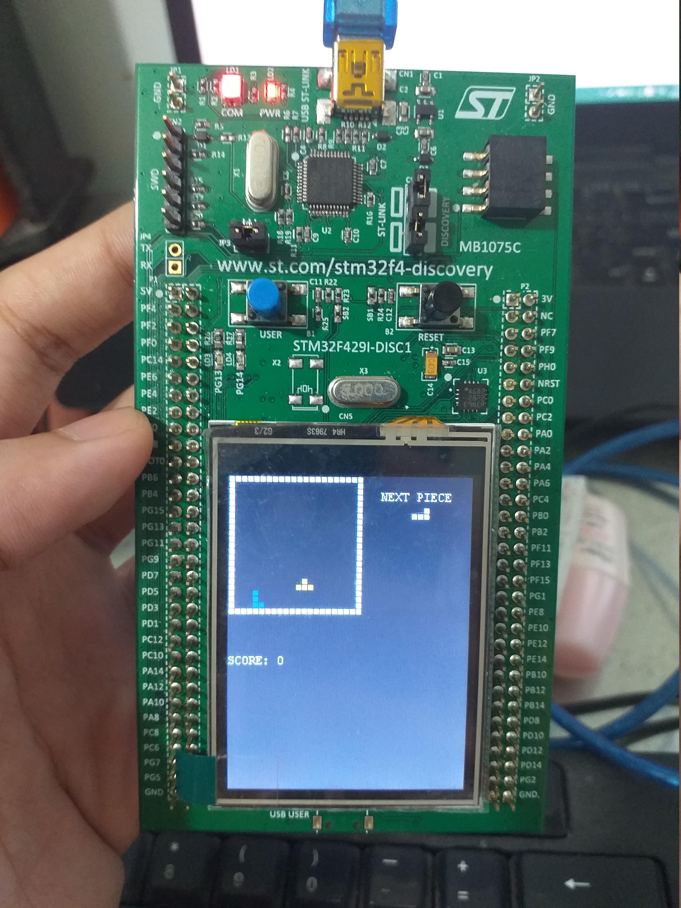
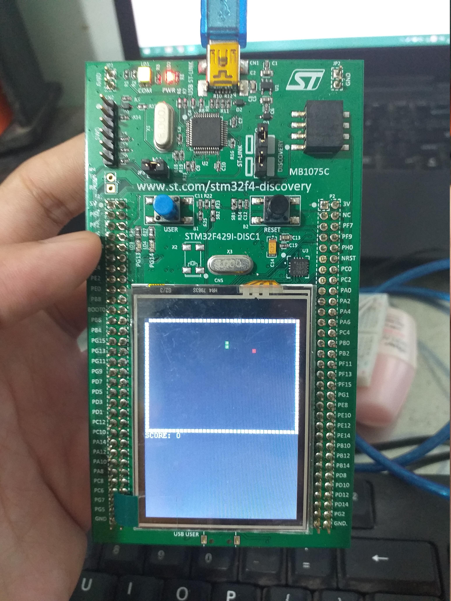

# TETRIS-SNAKE-STM32F4
TETRIS and SNAKE on STM32F429 Discovery Board.

This is a small group project that I had in the *Embedded System Design* class. There're still some flaws in it but it works.

 | 
:------------------------:|:----------------------:
*(TETRIS)* | *(SNAKE)*

<!--  This is a comment.
      These tags will display images side-by-side.
      But they're not in used.
-->
<!--

  
   

-->

**Read carefully** the instructions below if you want to play the games on the board.

## HOW TO USE IT?

* First, you need to copy all the directories in this repository to your project's root folder (I used STM32CubeIDE 1.3.0, but you can use whatever IDE you prefer).

* Then plug the board in, press *Launch* and let the IDE do its jobs.

> ***Note: Use the USER button (the blue one on the board) to switch between two games.***

## HOW TO CONTROL?

You will need ***a breadboard***, ***four buttons***, ***four 1 KOhm resistors***, ***wires*** to connect.

Connect the button with the pull-down resistor configuration (I don't know how to describe this but you understand, right? If you don't, you could try googling for _What the f*ck is pull-down (or pull-up) resistor and why do I have to use it?_), do this for all four buttons.

*(terrible wiring, I know)*

Then connect the UP, DOWN, LEFT, RIGHT buttons to the PB12, PB13, PC8, PC9 pins of the board, respectively and you'll good to go.
